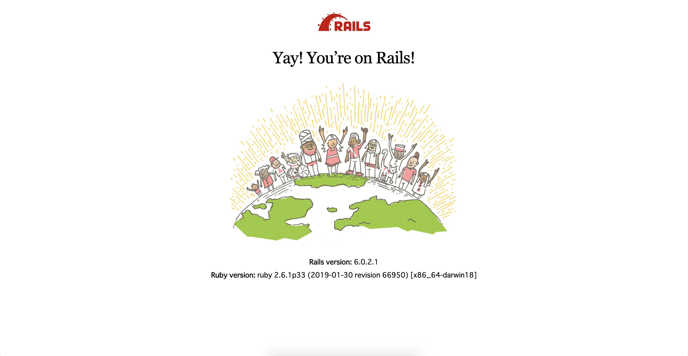

# sample_rails_application

rails ?????????????

## ????????????????

### 1. ???? Ruby ???? Bundle ???

```

$ rbenv local 2.6.1

$ bundle init

```

### 2. Gemfile ???

```

$ vim Gemfile

```

```

source 'https://rubygems.org'
git_source(:github) { |repo| "https://github.com/#{repo}.git" }

ruby '2.6.1'

gem 'rails', '~> 6.0.2', '>= 6.0.2.1'

```

### 3. Rails new ??

```

$ rails new . --database=mysql --skip-test --force

```

### 4. webpack ???????? vue ???????

```

$ bundle exec rails webpacker:install
> > Webpacker successfully installed ?? ??

$ bundle exec bin/webpack
> > Hash: 02cf28c4579467e946b3
> > Version: webpack 4.41.5
> > Time: 4605ms

$ bundle exec rails webpacker:install:vue
> > Webpacker now supports Vue.js ??

```

### 5. DB ??

```

$ vim config/database.yml

```

```
# ??? `mysql -h localhost -u root -p` ????????????????

default: &default
  adapter: mysql2
  encoding: utf8mb4
  pool: <%= ENV.fetch("RAILS_MAX_THREADS") { 5 } %>
  username: root
  host: localhost

development:
  <<: *default
  database: sample_rails_application_development

```

```

$ bundle exec rails db:create db:migrate
> > Created database 'sample_rails_application_development'
> > Created database 'sample_rails_application_test'

```

### 6. ???????

```

$ bundle exec rails s -b 0.0.0.0 -p 3000

```



### 7. page ???

```

$ bundle exec rails g controller Page home

```
