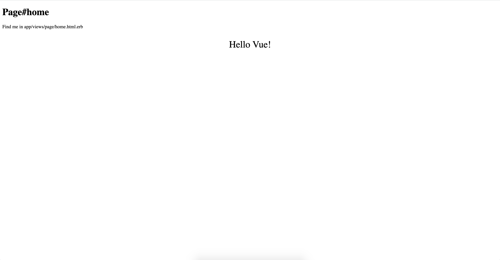

# sample_rails_application

rails ?????????????

## ????????????????

### 1. ???? Ruby ???? Bundle ???

```

$ rbenv local 2.6.1

$ bundle init

```

### 2. Gemfile ???

```

$ vim Gemfile

```

```

source 'https://rubygems.org'
git_source(:github) { |repo| "https://github.com/#{repo}.git" }

ruby '2.6.1'

gem 'rails', '~> 6.0.2', '>= 6.0.2.1'

```

### 3. Rails new ??

```

$ rails new . --database=mysql --skip-test --force

```

### 4. webpack ???????? vue ???????

```

$ bundle exec rails webpacker:install
> > Webpacker successfully installed ?? ??

$ bundle exec bin/webpack
> > Hash: 02cf28c4579467e946b3
> > Version: webpack 4.41.5
> > Time: 4605ms

$ bundle exec rails webpacker:install:vue
> > Webpacker now supports Vue.js ??

```

### 5. DB ??

```

$ vim config/database.yml

```

```
# ??? `mysql -h localhost -u root -p` ????????????????

default: &default
  adapter: mysql2
  encoding: utf8mb4
  pool: <%= ENV.fetch("RAILS_MAX_THREADS") { 5 } %>
  username: root
  host: localhost

development:
  <<: *default
  database: sample_rails_application_development

```

```

$ bundle exec rails db:create db:migrate
> > Created database 'sample_rails_application_development'
> > Created database 'sample_rails_application_test'

```

### 6. ???????

```

$ bundle exec rails s -b 0.0.0.0 -p 3000

```


### 7. hello vue ?????

```

$ bundle exec rails g controller Page home

$ vim config/routes.rb

```

```

Rails.application.routes.draw do
  root to: 'page#home'
end

```

```

$ vim app/views/page/home.html.erb

```

```

<h1>Page#home</h1>
<p>Find me in app/views/page/home.html.erb</p>

<%= javascript_pack_tag "hello_vue" %>

```



### vue ????????????????

- ??????

```

$ bundle exec rails g model book

```

- migration ???????

```

$ vim ./db/migrate/20200102071259_create_books.rb

```

```

class CreateBooks < ActiveRecord::Migration[6.0]
  def change
    create_table :books do |t|
      t.string :title, null: false, default: ""
      t.string :description, null: false, default: ""
      t.bigint :payment, null: false, default: 0
      t.timestamps
    end
  end
end

```

- migrate

```

$ bundle exec rails db:migrate
> > == 20200102071259 CreateBooks: migrating ======================================
> > -- create_table(:books)
> >    -> 0.0171s
> > == 20200102071259 CreateBooks: migrated (0.0171s) =============================

```

- seed ???

```

$ vim db/seeds.rb

```

```

20.times do |count|
  Book.create!(
    title: "????? No. #{count}",
    description: ['??????', '???', '???', '???', '???'].sample,
    payment: [1100, 1500, 2500, 3000, 4500, 6000].sample
  )
end

```

```

$ bundle exec rails db:seed

```

- ??????

```

mysql -hlocalhost -uroot -p sample_rails_application_development -e "select title from books"

+------------------------+
| title                  |
+------------------------+
| ????? No. 0       |
| ????? No. 1       |
| ????? No. 2       |
| ????? No. 3       |
| ????? No. 4       |
| ????? No. 5       |
| ????? No. 6       |
| ????? No. 7       |
| ????? No. 8       |
| ????? No. 9       |
| ????? No. 10      |
| ????? No. 11      |
| ????? No. 12      |
| ????? No. 13      |
| ????? No. 14      |
| ????? No. 15      |
| ????? No. 16      |
| ????? No. 17      |
| ????? No. 18      |
| ????? No. 19      |
+------------------------+

```

- axios ???????

```

$ yarn add axios
> > ?  Done in 3.56s.

```

- routes ???

```

$ vim routes.rb

```

```

Rails.application.routes.draw do
  root to: 'page#home'
  get "/api/v1/books", to: 'page#books'
end

```

- ?? `http://localhost:3000/api/v1/books.json`

```

[
  {
    "id": 1,
    "title": "????? No. 0",
    "description": "???",
    "payment": 2500,
    "created_at": "2020-01-02T07:21:37.728Z",
    "updated_at": "2020-01-02T07:21:37.728Z"
  },
  {
    "id": 2,
    "title": "????? No. 1",
    "description": "???",
    "payment": 6000,
    "created_at": "2020-01-02T07:21:37.732Z",
    "updated_at": "2020-01-02T07:21:37.732Z"
  },
  ...
  ...
  ...

```

- controller ???

```

$ vim app/controllers/page_controller.rb

```

```

class PageController < ApplicationController
  def home
  end

  def books
    json_str = Book.all.to_json
    parse_json = JSON.parse(json_str)
    render json: JSON.pretty_generate(parse_json)
  end
end

```

- vue ???????

```

$ vim app/javascript/app.vue

```

```

<template>
  <tbody>
    <tr>
      <th>Title</th>
      <th>Description</th>
      <th>Payment</th>
    </tr>
    <tr v-for="book in books" :key="book.id">
      <td>{{ book.title }}</td>
      <td>{{ book.description }}</td>
      <td>{{ book.payment }}</td>
    </tr>
  </tbody>
</template>

<script>
import axios from "axios";

export default {
  data: function() {
    return {
      books: {}
    };
  },

  mounted() {
    axios
      .get("/api/v1/books.json")
      .then(response => (this.books = response.data));
  }
};
</script>

<style scoped>
p {
  font-size: 2em;
  text-align: center;
}
</style>

```

- ??


- ?????????????

```

$ vim app/javascript/app.vue

```

```

<template>
  <tbody>
    <input type="text" v-model="keyword" />
    <tr v-for="book in filterBooks" :key="book.id">
      <td v-text="book.title"></td>
      <td v-text="book.description"></td>
      <td v-text="book.price"></td>
    </tr>
  </tbody>
</template>

<script>
import axios from "axios";

export default {
  data: function() {
    return {
      keyword: "",
      books: []
    };
  },

  mounted: function() {
    this.getBooks();
  },

  computed: {
    filterBooks: function() {
      return this.filteredBooks();
    }
  },
  methods: {
    getBooks: function() {
      axios
        .get("/api/v1/books.json")
        .then(response => (this.books = response.data));
    },
    filteredBooks: function() {
      var books = [];
      for (var i in this.books) {
        var book = this.books[i];
        if (book.title.indexOf(this.keyword) !== -1) {
          books.push(book);
        }
      }
      return books;
    }
  }
};
</script>

<style scoped>
p {
  font-size: 2em;
  text-align: center;
}
</style>

```

- ??


